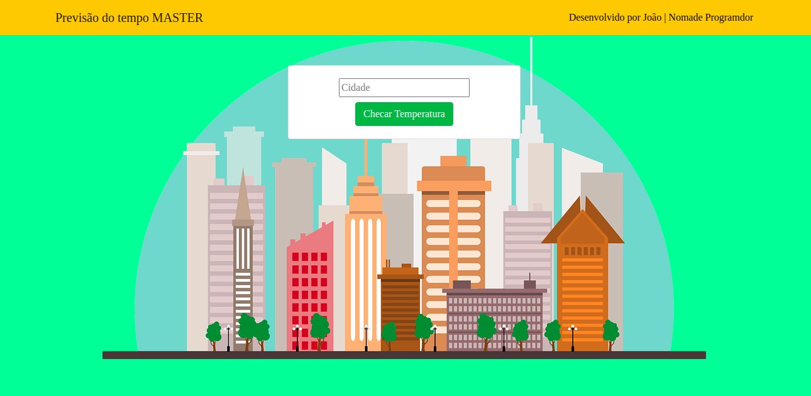
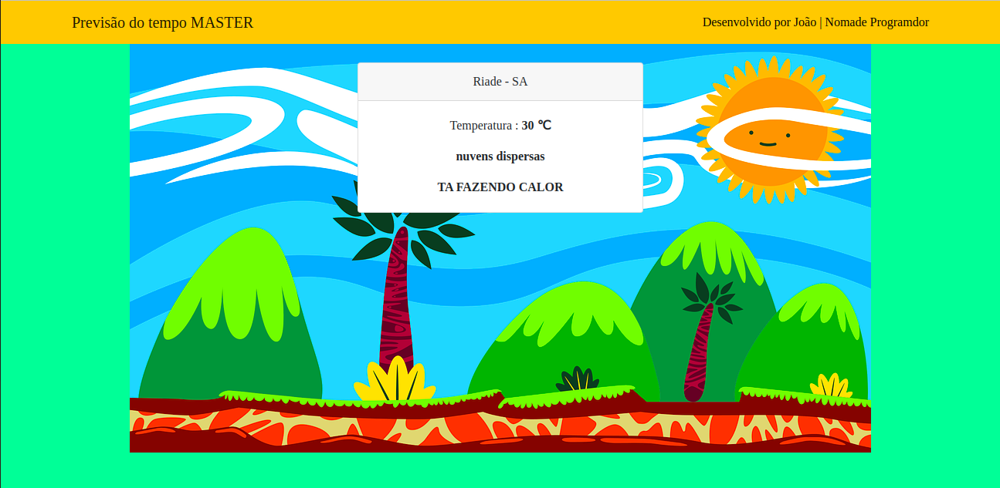

# previsao-do-tempo-app
#Como usar
- Git clone
- Após isso vá até a views e coloque sua API KEY que você encontrá  na https://openweathermap.org/api
- python manage.py runserver 
\n Seja feliz :) 

### Previsão do tempo app , utilizando django consumindo API  + bootstrap

# br 

